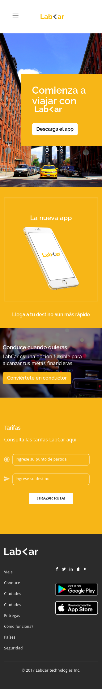

# LabCar-Sprint4

Página Web para ponerse en contacto con un taxi en Lima.

## Descripción del proyecto

Consta de 6 secciones:

* NavBar: Menu principal.
* Hero: Registro o descarga del App.
* Información: Explicación del App.
* Conduce: Para registrarse como conductor.
* Tarifa: Cotizar el recorrido del viaje.
* Footer: Menú, redes sociales y copy Rigth.

## Framework utilizado

Se utilizó el siguiente framework: Bootstrap 3.

## Lanzamiento 

Esta es la versión final de la página web del <a href="https://naovillaj.github.io/LabCar-Sprint4/">LabCar</a>

Versión Desktop: 
 

Versión Mobile:
 

Versión Mobile - NavBar: 
 

## Desarrollado con

Sublime 

* [HTML5] - Para la estructura de la página web
* [CSS3] - Para darle el estilo a la página web
* [JavaScript 1.8.5.] - Para las funcionalidades de la página web

## Autor

* **Naomi Villanueva** 
